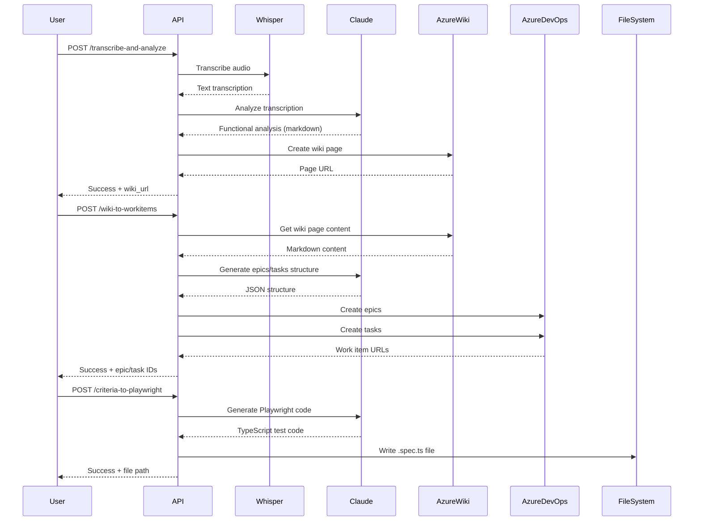

# MCP Workflow Automation - API REST

## 📋 Overview

Este módulo expone 3 endpoints HTTP REST que automatizan el flujo completo de toma de requisitos hasta generación de tests E2E.

```
Audio Meeting (Teams) → Transcripción → Análisis Funcional → Azure Wiki → Work Items → Tests Playwright
```

---

## 🚀 Endpoints Disponibles

### 1. **POST /api/mcp/transcribe-and-analyze**

Transcribe un audio de reunión Teams y genera análisis funcional en Azure Wiki.

**Request Body (JSON):**
```json
{
  "audio_path": "/path/to/meeting.mp4",
  "wiki_path": "/Análisis-Funcional/Proyecto-X"
}
```

**Response Success (200):**
```json
{
  "code": 200,
  "status": "success",
  "message": "transcribe-and-analyze-success",
  "data": {
    "wiki_url": "https://dev.azure.com/org/project/_wiki/wikis/wiki/123",
    "wiki_path": "/Análisis-Funcional/Proyecto-X",
    "transcription_length": 15234,
    "analysis_length": 8932
  }
}
```

**Ejemplo cURL:**
```bash
curl -X POST http://localhost:4300/api/mcp/transcribe-and-analyze \
  -H "Content-Type: application/json" \
  -d '{
    "audio_path": "/tmp/reunion-cliente.mp4",
    "wiki_path": "/Análisis-Funcional/Login-System"
  }'
```

---

### 2. **POST /api/mcp/wiki-to-workitems**

Genera épicas y tareas en Azure DevOps desde una página wiki de análisis funcional.

**Request Body (JSON):**
```json
{
  "wiki_page_id": "/Análisis-Funcional/Proyecto-X"
}
```

**Response Success (200):**
```json
{
  "code": 200,
  "status": "success",
  "message": "wiki-to-workitems-success",
  "data": {
    "epics_created": 3,
    "tasks_created": 15,
    "epics": [
      {
        "id": 12345,
        "title": "Módulo de Autenticación",
        "url": "https://dev.azure.com/org/project/_workitems/edit/12345"
      },
      {
        "id": 12346,
        "title": "Módulo de Usuarios",
        "url": "https://dev.azure.com/org/project/_workitems/edit/12346"
      }
    ]
  }
}
```

**Ejemplo cURL:**
```bash
curl -X POST http://localhost:4300/api/mcp/wiki-to-workitems \
  -H "Content-Type": application/json" \
  -d '{
    "wiki_page_id": "/Análisis-Funcional/Login-System"
  }'
```

---

### 3. **POST /api/mcp/criteria-to-playwright**

Genera tests Playwright desde criterios de aceptación en formato BDD.

**Request Body (JSON):**
```json
{
  "acceptance_criteria": "DADO que el usuario está en la página de login\nCUANDO ingresa credenciales válidas\nENTONCES es redirigido al dashboard",
  "output_path": "./tests/e2e/login.spec.ts"
}
```

**Response Success (200):**
```json
{
  "code": 200,
  "status": "success",
  "message": "criteria-to-playwright-success",
  "data": {
    "output_path": "./tests/e2e/login.spec.ts",
    "code_length": 1523,
    "preview": "import { test, expect } from '@playwright/test';\n\ntest.describe('Login', () => {\n  test('Usuario puede hacer login con credenciales válidas', async ({ page }) => {\n    // DADO: Usuario en página de login\n    await page.goto('/login');\n..."
  }
}
```

**Ejemplo cURL:**
```bash
curl -X POST http://localhost:4300/api/mcp/criteria-to-playwright \
  -H "Content-Type: application/json" \
  -d '{
    "acceptance_criteria": "DADO que el usuario está en /login\nCUANDO ingresa email y password válidos\nENTONCES es redirigido a /dashboard",
    "output_path": "./tests/e2e/login.spec.ts"
  }'
```

---

## ⚙️ Configuración

### Variables de Entorno Requeridas

Edita `.env` y configura:

```bash
# OpenAI Whisper API
OPENAI_API_KEY="sk-..."

# Anthropic Claude API
ANTHROPIC_API_KEY="sk-ant-..."

# Azure DevOps
AZURE_DEVOPS_ORG_URL="https://dev.azure.com/your-org"
AZURE_DEVOPS_PROJECT="your-project-name"
AZURE_DEVOPS_PAT="your-personal-access-token"
AZURE_WIKI_ID="your-wiki-identifier"
```

### Obtener Azure DevOps PAT

1. Ve a Azure DevOps → User Settings → Personal Access Tokens
2. Crea token con permisos:
   - **Work Items**: Read & Write
   - **Wiki**: Read & Write
3. Copia el token en `AZURE_DEVOPS_PAT`

### Obtener Azure Wiki ID

```bash
# Llamar a la API para listar wikis
curl -u :YOUR_PAT https://dev.azure.com/{organization}/{project}/_apis/wiki/wikis?api-version=7.0

# Copiar el "id" del wiki que quieras usar
```

---

## 🏗️ Arquitectura

```
App/Modules/
├── Transcription/
│   ├── Domain/Types/
│   └── Infrastructure/Clients/
│       └── WhisperApiClient.ts          # Llamadas a OpenAI Whisper API
│
├── FunctionalAnalysis/
│   ├── Domain/Types/
│   ├── Application/Services/
│   │   ├── AnalyzeMeetingTranscription/
│   │   ├── GenerateWorkItemsStructure/
│   │   └── GeneratePlaywrightTests/
│   └── Infrastructure/Clients/
│       └── ClaudeApiClient.ts           # Llamadas a Claude API
│
├── AzureWiki/
│   ├── Domain/Types/
│   └── Infrastructure/Clients/
│       └── AzureWikiApiClient.ts        # Azure Wiki REST API
│
├── AzureDevOps/
│   ├── Domain/Types/
│   └── Infrastructure/Clients/
│       └── AzureDevOpsApiClient.ts      # Azure DevOps REST API
│
├── PlaywrightGenerator/
│   └── Domain/Types/
│
└── McpServer/
    ├── Domain/Types/
    ├── Infrastructure/
    │   ├── Routes/
    │   │   └── McpRouteEnum.ts
    │   └── Controllers/
    │       ├── TranscribeAndAnalyzeController.ts
    │       ├── WikiToWorkItemsController.ts
    │       └── CriteriaToPlaywrightController.ts
    └── README.md (este archivo)
```

---

## 🧪 Testing

Los endpoints pueden ser probados con:

### Opción 1: cURL (ejemplos arriba)

### Opción 2: Postman

Importa esta colección:

```json
{
  "info": { "name": "MCP Workflow API" },
  "item": [
    {
      "name": "Transcribe and Analyze",
      "request": {
        "method": "POST",
        "url": "http://localhost:4300/api/mcp/transcribe-and-analyze",
        "body": {
          "mode": "raw",
          "raw": "{\n  \"audio_path\": \"/tmp/meeting.mp4\",\n  \"wiki_path\": \"/Test/Demo\"\n}"
        }
      }
    }
  ]
}
```

### Opción 3: Tests E2E (recomendado)

```typescript
// Tests/Modules/McpServer/Infrastructure/Controllers/TranscribeAndAnalyzeController/TranscribeAndAnalyzeControllerTest.ts

import { describe, it } from "https://deno.land/std@0.208.0/testing/bdd.ts";
import { assertEquals } from "https://deno.land/std@0.208.0/assert/mod.ts";
import { HttpRequestMock } from "Tests/Modules/Shared/Infrastructure/Components/HttpRequestMock.ts";
import { TranscribeAndAnalyzeController } from "App/Modules/McpServer/Infrastructure/Controllers/TranscribeAndAnalyzeController.ts";

describe("TranscribeAndAnalyzeController", () => {
  it("should return success when valid parameters", async () => {
    const request = HttpRequestMock.getInstance()
      .setPostParams({
        "audio_path": "/path/test.mp4",
        "wiki_path": "/Test/Demo"
      })
      .getMockedInstance();

    const response = await TranscribeAndAnalyzeController.getInstance().invoke(request);
    const data = response.toPrimitives();

    assertEquals(data.statusCode, 200);
  });
});
```

---

## 📊 Flujo Completo



---

## ⚡ Quick Start

```bash
# 1. Clonar y configurar
cd C:/projects/prj-deno-pocs/mcps-tools
cp .env.example .env
# Editar .env con tus API keys

# 2. Iniciar servidor
deno task start
# Server running on http://0.0.0.0:4300

# 3. Probar endpoint
curl -X POST http://localhost:4300/api/mcp/criteria-to-playwright \
  -H "Content-Type: application/json" \
  -d '{
    "acceptance_criteria": "DADO usuario autenticado\nCUANDO hace clic en logout\nENTONCES es redirigido a /login",
    "output_path": "./logout.spec.ts"
  }'
```

---

## 🔍 Troubleshooting

### Error: "OPENAI_API_KEY not found"
- Verifica que `.env` tenga `OPENAI_API_KEY=sk-...`
- Reinicia el servidor después de editar `.env`

### Error: "Azure DevOps API error: 401"
- Verifica que `AZURE_DEVOPS_PAT` sea válido
- Revisa que el PAT tenga permisos de Work Items y Wiki

### Error: "Failed to transcribe audio"
- Verifica que el archivo exista en `audio_path`
- Formatos soportados: .mp4, .m4a, .mp3, .wav
- Tamaño máximo: 25 MB (límite de Whisper API)

---

## 📝 Roadmap Futuro

- [ ] Soporte para múltiples idiomas en transcripción
- [ ] Webhook para notificar cuando work items estén creados
- [ ] Generación automática de diagramas UML desde análisis funcional
- [ ] Integración con Jira (además de Azure DevOps)
- [ ] Cache de análisis funcionales para evitar re-procesamiento

---

## 📄 Licencia

Interno - Uso exclusivo para automatización de workflows de toma de requisitos.
