# 🚀 MCP Workflow - Setup Completo

## ✅ IMPLEMENTACIÓN COMPLETADA

Se ha implementado una arquitectura completa de **3 endpoints HTTP REST** que automatizan el flujo de toma de requisitos → análisis funcional → work items → tests E2E.

---

## 📁 Estructura de Módulos Creados

```
App/Modules/
├── Transcription/                          # ✅ Módulo de transcripción
│   ├── Domain/Types/
│   │   ├── TranscriptionResultType.ts
│   │   └── AudioFileType.ts
│   └── Infrastructure/Clients/
│       └── WhisperApiClient.ts             # Cliente OpenAI Whisper API
│
├── FunctionalAnalysis/                     # ✅ Módulo de análisis funcional
│   ├── Domain/Types/
│   │   └── FunctionalAnalysisType.ts
│   ├── Application/Services/
│   │   ├── AnalyzeMeetingTranscription/
│   │   │   └── AnalyzeMeetingTranscriptionService.ts
│   │   ├── GenerateWorkItemsStructure/
│   │   │   └── GenerateWorkItemsStructureService.ts
│   │   └── GeneratePlaywrightTests/
│   │       └── GeneratePlaywrightTestsService.ts
│   └── Infrastructure/Clients/
│       └── ClaudeApiClient.ts              # Cliente Anthropic Claude API
│
├── AzureWiki/                              # ✅ Módulo Azure Wiki
│   ├── Domain/Types/
│   │   └── WikiPageType.ts
│   └── Infrastructure/Clients/
│       └── AzureWikiApiClient.ts           # Cliente Azure Wiki API
│
├── AzureDevOps/                            # ✅ Módulo Azure DevOps
│   ├── Domain/Types/
│   │   └── WorkItemType.ts
│   └── Infrastructure/Clients/
│       └── AzureDevOpsApiClient.ts         # Cliente Azure DevOps API
│
├── PlaywrightGenerator/                    # ✅ Módulo generador Playwright
│   └── Domain/Types/
│       └── PlaywrightTestType.ts
│
└── McpServer/                              # ✅ Módulo MCP Server (Orchestration)
    ├── Domain/Types/
    │   └── McpToolType.ts
    ├── Infrastructure/
    │   ├── Routes/
    │   │   └── McpRouteEnum.ts
    │   └── Controllers/
    │       ├── TranscribeAndAnalyzeController.ts
    │       ├── WikiToWorkItemsController.ts
    │       └── CriteriaToPlaywrightController.ts
    └── README.md
```

---

## 🌐 Endpoints HTTP REST Disponibles

### 1. **POST /api/mcp/transcribe-and-analyze**

**Flujo:**
```
Audio (.mp4/.m4a) → Whisper API → Claude API → Azure Wiki
```

**Payload:**
```json
{
  "audio_path": "/path/to/reunion-teams.mp4",
  "wiki_path": "/Análisis-Funcional/Sistema-Login"
}
```

**Response:**
```json
{
  "code": 200,
  "status": "success",
  "data": {
    "wiki_url": "https://dev.azure.com/.../wiki/123",
    "wiki_path": "/Análisis-Funcional/Sistema-Login"
  }
}
```

---

### 2. **POST /api/mcp/wiki-to-workitems**

**Flujo:**
```
Azure Wiki Page → Claude API → Azure DevOps (Epics + Tasks)
```

**Payload:**
```json
{
  "wiki_page_id": "/Análisis-Funcional/Sistema-Login"
}
```

**Response:**
```json
{
  "code": 200,
  "status": "success",
  "data": {
    "epics_created": 2,
    "tasks_created": 10,
    "epics": [
      {
        "id": 12345,
        "title": "Módulo de Autenticación",
        "url": "https://dev.azure.com/.../workitems/12345"
      }
    ]
  }
}
```

---

### 3. **POST /api/mcp/criteria-to-playwright**

**Flujo:**
```
Criterios BDD → Claude API → Playwright .spec.ts file
```

**Payload:**
```json
{
  "acceptance_criteria": "DADO usuario en /login\nCUANDO ingresa credenciales válidas\nENTONCES es redirigido a /dashboard",
  "output_path": "./tests/e2e/login.spec.ts"
}
```

**Response:**
```json
{
  "code": 200,
  "status": "success",
  "data": {
    "output_path": "./tests/e2e/login.spec.ts",
    "code_length": 1523
  }
}
```

---

## ⚙️ Configuración Necesaria

### 1. **Variables de Entorno**

Agrega a tu `.env`:

```bash
# MCP Workflow - API Keys
OPENAI_API_KEY="sk-your-openai-key"
ANTHROPIC_API_KEY="sk-ant-your-claude-key"

# Azure DevOps & Wiki
AZURE_DEVOPS_ORG_URL="https://dev.azure.com/your-org"
AZURE_DEVOPS_PROJECT="your-project"
AZURE_DEVOPS_PAT="your-personal-access-token"
AZURE_WIKI_ID="your-wiki-id"
```

### 2. **Obtener API Keys**

#### OpenAI (Whisper):
```
1. https://platform.openai.com/api-keys
2. Create new secret key
3. Copiar en OPENAI_API_KEY
```

#### Anthropic (Claude):
```
1. https://console.anthropic.com/settings/keys
2. Create Key
3. Copiar en ANTHROPIC_API_KEY
```

#### Azure DevOps PAT:
```
1. Azure DevOps → User Settings → Personal Access Tokens
2. New Token con permisos:
   - Work Items: Read & Write
   - Wiki: Read & Write
3. Copiar en AZURE_DEVOPS_PAT
```

#### Azure Wiki ID:
```bash
curl -u :YOUR_PAT \
  https://dev.azure.com/{org}/{project}/_apis/wiki/wikis?api-version=7.0

# Copiar el "id" del response
```

---

## 🧪 Testing

### Probar que el servidor arranca:

```bash
cd C:\projects\prj-deno-pocs\mcps-tools

# Iniciar servidor
deno task start

# Debería mostrar:
# Server running on http://0.0.0.0:4300
```

### Probar endpoint con cURL:

```bash
# Test 1: Generar tests Playwright (sin dependencies externas)
curl -X POST http://localhost:4300/api/mcp/criteria-to-playwright \
  -H "Content-Type: application/json" \
  -d '{
    "acceptance_criteria": "DADO usuario autenticado\nCUANDO hace clic en logout\nENTONCES sesión se cierra",
    "output_path": "./test-output.spec.ts"
  }'

# Debería retornar:
# {
#   "code": 200,
#   "status": "success",
#   ...
# }
```

### Verificar archivo generado:

```bash
cat ./test-output.spec.ts

# Debería contener código Playwright válido
```

---

## 🏗️ Arquitectura de Servicios

### Clients (API Integrations):

| Client | Responsabilidad | Endpoint |
|--------|----------------|----------|
| **WhisperApiClient** | Transcribir audio | OpenAI Whisper API |
| **ClaudeApiClient** | Generar análisis/código | Anthropic Claude API |
| **AzureWikiApiClient** | CRUD de páginas wiki | Azure DevOps Wiki API |
| **AzureDevOpsApiClient** | CRUD de work items | Azure DevOps REST API |

### Services (Business Logic):

| Service | Input | Output |
|---------|-------|--------|
| **AnalyzeMeetingTranscriptionService** | Transcripción texto | Análisis funcional Markdown |
| **GenerateWorkItemsStructureService** | Análisis funcional | JSON de épicas/tareas |
| **GeneratePlaywrightTestsService** | Criterios BDD | Código TypeScript |

### Controllers (HTTP Endpoints):

| Controller | Route | HTTP Method |
|------------|-------|-------------|
| **TranscribeAndAnalyzeController** | `/api/mcp/transcribe-and-analyze` | POST |
| **WikiToWorkItemsController** | `/api/mcp/wiki-to-workitems` | POST |
| **CriteriaToPlaywrightController** | `/api/mcp/criteria-to-playwright` | POST |

---

## 📊 Flujo End-to-End Completo

```mermaid
graph LR
    A[Reunión Teams<br/>.mp4 audio] -->|POST /transcribe-and-analyze| B[Whisper API]
    B --> C[Claude API:<br/>Análisis Funcional]
    C --> D[Azure Wiki:<br/>Página creada]

    D -->|POST /wiki-to-workitems| E[Claude API:<br/>Generar estructura]
    E --> F[Azure DevOps:<br/>Épicas + Tareas]

    F -->|POST /criteria-to-playwright| G[Claude API:<br/>Generar tests]
    G --> H[Archivo .spec.ts<br/>creado]

    style A fill:#e1f5ff
    style D fill:#c3e6cb
    style F fill:#c3e6cb
    style H fill:#c3e6cb
```



---

## 🎯 Ejemplo de Uso Completo

### Paso 1: Grabar reunión en Teams
- Descargar archivo `.mp4` de reunión
- Guardar en `/tmp/reunion-cliente.mp4`

### Paso 2: Transcribir y analizar
```bash
curl -X POST http://localhost:4300/api/mcp/transcribe-and-analyze \
  -H "Content-Type: application/json" \
  -d '{
    "audio_path": "/tmp/reunion-cliente.mp4",
    "wiki_path": "/Análisis-Funcional/Sistema-Pagos"
  }'

# Response:
# { "data": { "wiki_url": "..." } }
```

### Paso 3: Generar work items
```bash
curl -X POST http://localhost:4300/api/mcp/wiki-to-workitems \
  -H "Content-Type: application/json" \
  -d '{
    "wiki_page_id": "/Análisis-Funcional/Sistema-Pagos"
  }'

# Response:
# { "data": { "epics_created": 3, "tasks_created": 15 } }
```

### Paso 4: Generar tests E2E
```bash
# Copiar criterios de aceptación desde Azure DevOps
CRITERIOS="DADO usuario con saldo suficiente
CUANDO confirma pago
ENTONCES transacción se procesa correctamente"

curl -X POST http://localhost:4300/api/mcp/criteria-to-playwright \
  -H "Content-Type: application/json" \
  -d "{
    \"acceptance_criteria\": \"$CRITERIOS\",
    \"output_path\": \"./tests/e2e/pagos.spec.ts\"
  }"
```

### Paso 5: Ejecutar tests generados
```bash
npx playwright test tests/e2e/pagos.spec.ts
```

---

## 📝 Próximos Pasos

### Para empezar a usar:

1. ✅ **Configurar `.env`** con todas las API keys
2. ✅ **Iniciar servidor**: `deno task start`
3. ✅ **Probar endpoint simple**: `/criteria-to-playwright`
4. ⏳ **Probar flujo completo** con audio real de Teams

### Para extender funcionalidad:

- [ ] Agregar webhook para notificar cuando work items estén listos
- [ ] Implementar cache de análisis para evitar re-procesamiento
- [ ] Agregar soporte para múltiples idiomas
- [ ] Integrar con Jira (además de Azure DevOps)

---

## 🔍 Troubleshooting

### Error: "OPENAI_API_KEY not found"
**Solución:** Verifica que `.env` tenga la key y reinicia el servidor

### Error: "Azure DevOps API error: 401"
**Solución:** Verifica que el PAT tenga permisos correctos (Work Items + Wiki)

### Error: "Failed to transcribe audio"
**Solución:**
- Verifica que el archivo exista
- Formatos soportados: .mp4, .m4a, .mp3, .wav
- Tamaño máximo: 25 MB

---

## 📚 Documentación Adicional

- **API completa:** `App/Modules/McpServer/README.md`
- **Testing:** `Tests/README.md`
- **Arquitectura DDD:** Ver estructura de módulos arriba

---

## ✨ Resumen

**Se han implementado:**
- ✅ 5 módulos DDD completos
- ✅ 4 clientes API (Whisper, Claude, Azure Wiki, Azure DevOps)
- ✅ 3 servicios de aplicación
- ✅ 3 controllers HTTP REST
- ✅ 3 endpoints funcionales
- ✅ Variables de entorno configuradas
- ✅ Documentación completa

**El servidor está listo para:**
- Transcribir audios de reuniones
- Generar análisis funcionales automáticos
- Crear work items en Azure DevOps
- Generar tests Playwright E2E

**Punto de arranque:** `public/index.ts` (servidor HTTP Deno)
